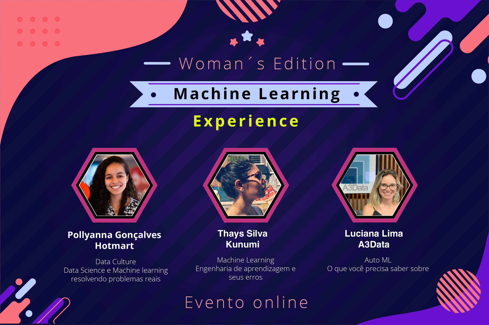

# Apresentações - Machine Learning Experience

Neste diretório você vai encontrar as apresentações ministradas na comunidade do Machine Learning Experience. As apresentações de cada evento estarão em sua pasta especifica com a descrição relacionada ao nome do evento.

* **Kunumi** 
* **DTI Digital** 
* **Woman´s Edition** 
* **AI Strategy + ML Ops** 

## Kunumi

Edição especial realizada em parceria com a Kunumi. Teremos um conteúdo muito especial organizado para aprofundar os seus conhecimento sobre Machine Learning

#### Apresentações:

* [Parte 1 - Projeto e validação](https://github.com/MarcusWiilo/Machine-Learning-Experience/blob/master/Presentations/Kunumi/1%20-%20Projeto%20e%20validac%CC%A7a%CC%83o.pdf)
* [Parte 2 - Implantação e monitoramento](https://github.com/MarcusWiilo/Machine-Learning-Experience/blob/master/Presentations/Kunumi/2%20-%20Implantac%CC%A7a%CC%83o%20e%20Monitoramento.pdf)

#### Link da transmissão no YouTube:

* [Implantação de projeto de machine learning de ponta a ponta.](https://www.youtube.com/watch?v=NtTloC1xwqA)

## DTI Digital

These instructions will get you a copy of the project up and running on your local machine for development and testing purposes. See deployment for notes on how to deploy the project on a live system.

#### Apresentações:

* [Parte 1 - Infraestrutura de Machine Learning com Kubeflow](https://github.com/MarcusWiilo/Machine-Learning-Experience/blob/master/Presentations/DTI%20Digital/Marcelo%20Pio%20Infraestrutura%20de%20ML%20com%20Kubeflow_.pdf) - Marcelo Pio
* [Parte 2 - Construindo soluções de ML em cloud com Terraform](https://github.com/MarcusWiilo/Machine-Learning-Experience/blob/master/Presentations/DTI%20Digital/Daniel%20Machado%20Terraform%20as%20ML%20IaC.pdf) - Daniel Machado

#### Link da transmissão do YouTube:

* [Parte 1 - Infraestrutura de Machine Learning com Kubeflow](https://www.youtube.com/watch?v=uA0ykZLvRFY) - Marcelo Pio
* [Parte 2 - Construindo soluções de ML em cloud com Terraform](https://www.youtube.com/watch?v=QThSorW2pyQ&t=1s)

## Woman´s Edition

#### Apresentações:

* [Parte 1 - Data cultura: Data science e machine learning resolvendo problemas reais](https://github.com/MarcusWiilo/Machine-Learning-Experience/blob/master/Presentations/Woman%C2%B4s%20Edition/%5BML%20Experience%5D%20Pollyanna_Data%20Culture_%20Data%20Science%20e%20Machine%20Learning%20resolvendo%20problemas%20reais.pdf) - Pollyanna Gonçalves - Coordenadora de ciência de dados na Hotmart
* [Parte 2 - O que você precisa saber sobre Auto ML](https://github.com/MarcusWiilo/Machine-Learning-Experience/blob/master/Presentations/Woman%C2%B4s%20Edition/OQueVoc%C3%AAPrecisaSaberSobreAutoML_LucianaLima.pdf) - Luciana Lima - Head de Analytics na A3 Data
* [Parte 3 - Engenharia de aprendizagem e seus erros](https://github.com/MarcusWiilo/Machine-Learning-Experience/blob/master/Presentations/Woman%C2%B4s%20Edition/Aprendizado%20de%20ma%CC%81quina%20e%20seus%20erros.pdf) - Thays Silva - Engenheira de Machine Learning na Kunumi

#### Link da transmissão do YouTube:

* [Machine Learning Experience | Woman´s Edition](https://www.youtube.com/watch?v=LbzRKVEKvMo) - Evento online

## AI Strategy + ML Ops 

#### Apresentações:

* [Parte 1 - IA Estratégica - trazendo competitividade para sua empresa](https://github.com/MarcusWiilo/Machine-Learning-Experience/blob/master/Presentations/AI-Strategy_ML-Ops/Estrate%CC%81gia-IA-Kunumi-Gibram-Raul.pdf) - Gibram Raum - Cientista de dados na Kunumi
* [Parte 2 - O papel de dados não rotulados em aprendizado de máquina](https://github.com/MarcusWiilo/Machine-Learning-Experience/blob/master/Presentations/AI-Strategy_ML-Ops/O-papel-de-dados-sem-rotulos-Fernanda-Guimaraes_Thays-Silva.pdf) - Feranda Guimarães + Thays Silva - Engenheiras de Machine Learning na Kunumi
* [Parte 3 - ML Ops na Cloud](https://github.com/MarcusWiilo/Machine-Learning-Experience/blob/master/Presentations/AI-Strategy_ML-Ops/MLOps-on-the-cloud-neylson-crepalde.pdf) - Neylson Crepalde - Cientista de dados na A3 Data
#### Link da transmissão do YouTube:

* [Machine Learning Experience | Edição Ai Strategy + ML Ops](https://www.youtube.com/watch?v=yIrOLHjHXrw) - Evento online

## Organizadores da comunidade

* **Marcus Oliveira** - *Initial work* - [PurpleBooth](https://github.com/PurpleBooth)
* **Túlio Vieira Souza** - *Initial work* - [PurpleBooth](https://github.com/PurpleBooth)

See also the list of [contributors](https://github.com/your/project/contributors) who participated in this project.

